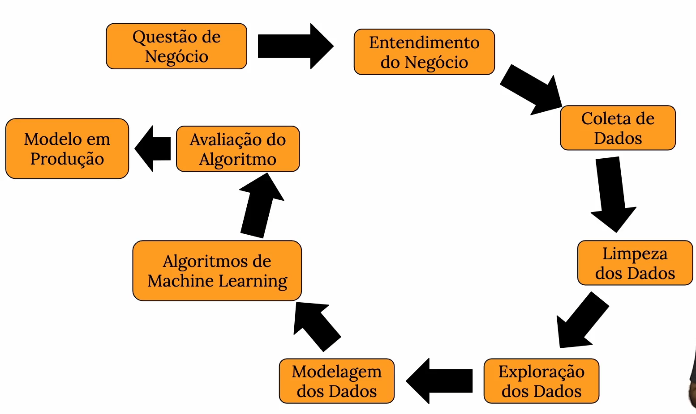
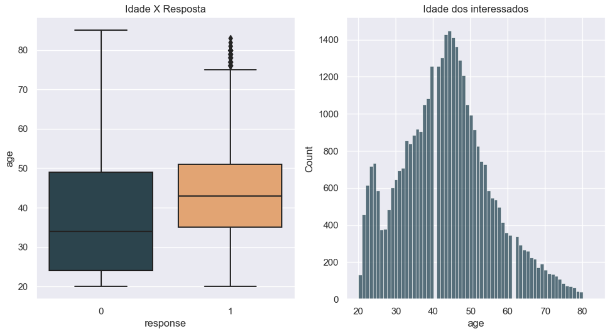
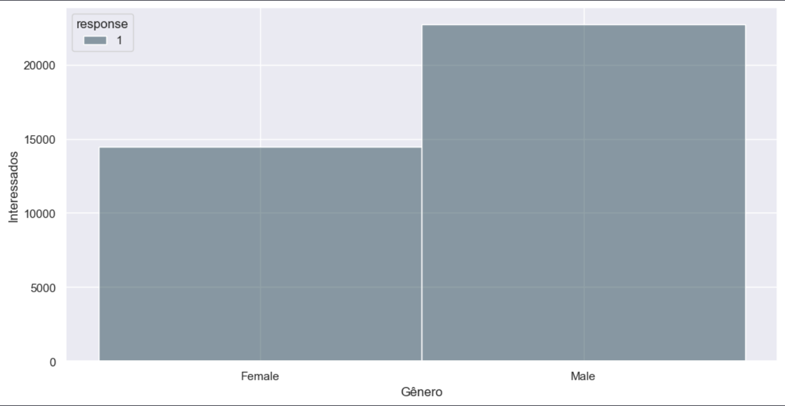
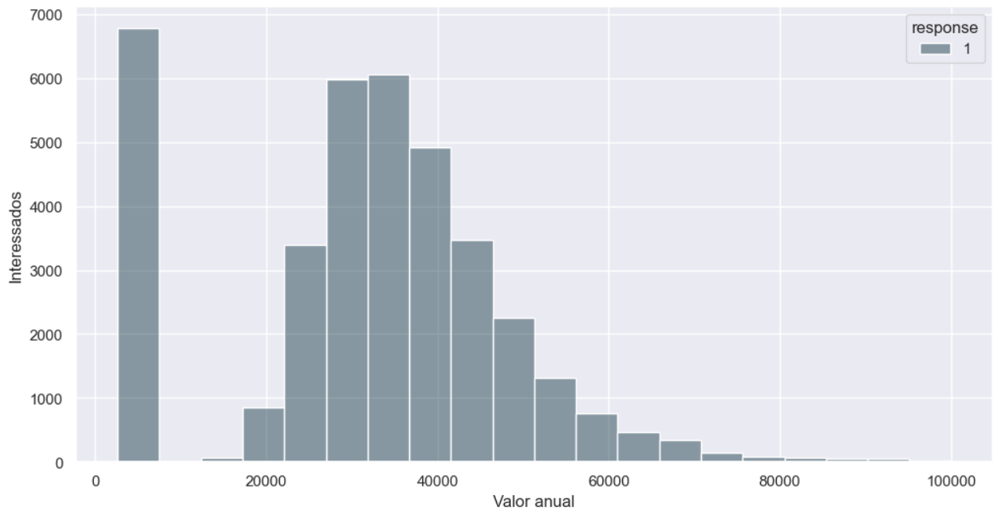
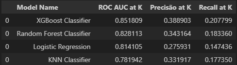
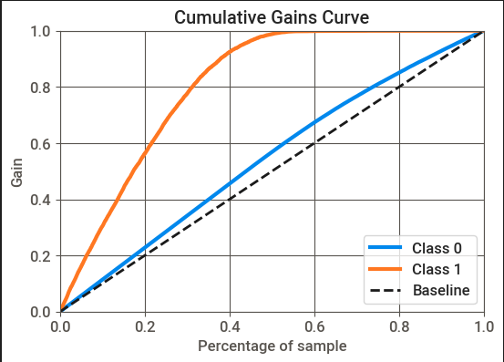
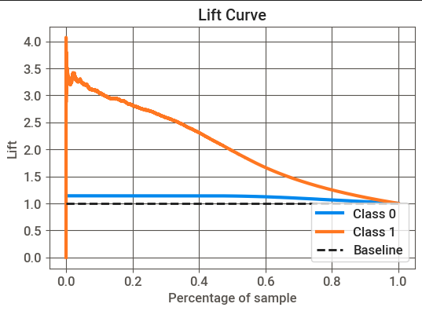
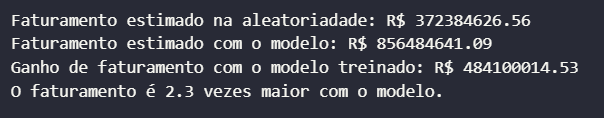
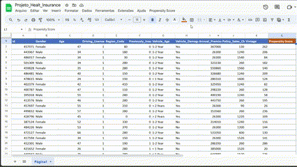

# **Sistema de Recomendação - Cross-Selling de Seguros**

Contexto: Nosso cliente é uma Seguradora que forneceu Seguro Saúde para seus clientes agora eles precisam construir um modelo para prever se os segurados (clientes) do ano passado também estarão interessados no Seguro Veicular fornecido pela empresa.

Construir um modelo para prever se um cliente estaria interessado em Seguro de Veículo é extremamente útil para a empresa, pois ela pode planejar sua estratégia de comunicação para alcançar esses clientes e otimizar sua receita a partir do ranqueamento dos clientes interessados na aquisição de um seguro veicular.

## 1. Problema de Negócio

A empresa contratante é tradicional em seguros de saúde. Realizando uma pesquisa, obteve informações sobre o interesse de aproximandamente 304 mil clientes em adquirir o seguro veicular agora ofertado.

Porém existem mais 76 mil clientes que não responderam a pesquisa. O desafio é criar uma lista ordenada pela probabilidade do cliente estar interessado no seguro de veículo. Portanto, a lista ordenada por interesse deste grupo de clientes tem como fim otimizar a conversão e o faturamento da empresa.

## 2. Premissas de Negócio assumidas

1. Clientes com grande probabilidade de interesse na lista ordenada certamente fecham o contrato.
2. O valor médio do seguro de sáude é igual ao veicular.
3. O time de vendas já utiliza o Google Sheets como ferramenta,Todavia, vamos incorporar o ranking de propensão de compra a ferramenta já utilizada pela equipe.

## 3. Estratégia da Solução

A abordagem para resolver o desafio, seguindo a metodologia CRISP-DS , a qual se divide em 9 passos cíclicos para entrega de valor de forma rápida para a empresa, consiste em :

1. Problema de Negócio: Receber o problema de negócio das aréas solicitantes.
2. Entendimento de Negócio: Compreender a necessidade e dor dos setores envolvidos, validando protótipos de solução.
3. Coleta de Dados: Obter os dados necessários das tabelas do banco de dados da empresa.
4. Limpeza dos Dados: Remover sujeiras nos dados que possam afetar a performance do algoritmo de Machine Learning.
5. Exploração dos Dados: Analisar e entender as relações entre os dados, criando hipóteses acionáveis e novas features.
6. Análise Explorátoria dos Dados: Analisar e entender as relações entre os dados, criando hipóteses acionáveis e novas features.
7. Modelagem dos Dados: Preparar os dados para uso em algoritmos de Machine Learning, realizando transformações e encoding.
8. Aplicação de Algoritmos de Machine Learning: Selecionar e aplicar algoritmos nos dados preparados, comparando sua performance.
9. Avaliação de Performance: Verificar a performance do algoritmo selecionado em relação aos resultados atuais e traduzir para retorno financeiro.
10. Publicação da Solução: Publicar o algoritmo selecionado, tornando a solução disponível e utilizável.

### 3.1 Ferramentas Utilizadas

Foram utilizadas as seguintes ferramentas para criar a solução:

- Linguagem Python 3.10.13
- Jupyter Notebook para prototipação
- Git e Github para versionamento de código
- Manipulação e visualização de dados em linguagem Python
- Algoritmos de Classificação com as biblioteca Scikit-Learn e XGBoost 
- Técnicas de Seleção de Features utilizando a biblioteca Shap
- Otimização dos Hiperparâmetros pelo framework Optuna
- Biblioteca Flask para criação de API´s

### 3.2 Produto Final

No processo de criação do produto final, o modelo foi hospedado na nuvem para ser consultado via API. Por meio de uma planilha no Google Sheets contendo informações dos clientes, podemos acessar o modelo via API e realizar previsões por meio de uma aplicação criada no Apps Script.

Essa aplicação retorna a lista de clientes com seu score de propensão de compra, ordenando-os com os clientes mais propensos no topo da lista.

Acesso a planilha: [Health Insurance -  Google Sheets](https://docs.google.com/spreadsheets/d/1bxORNnMYdfmVxwxfKkQ8WX9d1NmGIojH1XAfh1s4VHI/edit?usp=sharing)

## 4. Os 3 Principais Insights de Dados

Durante a Análise Exploratório dos dados foram levantadas hipóteses de negócio, as quais pode gerar novas informações ou contrapor crenças já estabelecidas, como resultado são gerados insights acionáveis ao time de negócio, podendo ser usados como direcionamento para tomada de decisão.

### **Hipótese 1** - Clientes mais novos têm maior interesse em adquirir seguro veicular?

- Hipótese **FALSA** - O maior interesse pelo seguro está na faixa de idade entre 40 e 50 anos, demonstrando uma procura menor em idades inferiores a 35 anos e superiores aos 55 anos.

- Insight: Elaborar uma análise SWOT para entender a fundo o cenário de precificação do seguro para os jovens, a fim de procurar altenativas para oferecer pacotes mais atrativos e melhorar a oferta do produto.

### **Hipótese 2** - O gênero do cliente pode ser um fator de influência, existe diferença na propensão a adquirir um seguro de veículo?

- Hipótese **VERDADEIRA** - Dentro os interessados no seguro os homens são maioria.

- Insight: Focar futuras campanhas de marketing em canais com foco no gênero predominante.

### **Hipótese 3** - O preço do seguro de veículo tem alguma influência? Preços ou planos específicos são fatores importantes para conquistar os clientes?

- Hipótese **VERDADEIRA** - A uma maioria dos interessados no seguro se concentra no seguro anual com valor 2630 ou na média proxima a 30000, Demonstrando um padrão que deve representar um plano básico com menor valor, e um plano mais abrangente para carros e idades medianas, visto que são dois fatores de grande influência para o calculo do valor pago pelos assegurados.

- Insight: Cria uma estratégia de Upselling, na qual oferta de um plano intermédiario com vantagens e preço acessivel para upgrade dos que possuem plano básico.

## 5. Modelos de Machine Learning

No primeiro ciclo do projeto, foram testados quatro algoritmos para escolher o melhor em termos de desempenho e custo de implementação.

Abordagem adotada na etapa inicial:

- Foco na simplicidade
- Entrega de uma solução minimamente utilizável

Algoritmos selecionados:

- KNN Classifier
- Linear Regression
- Random Forest Classifier
- XGBoost Classifier

**Desempenho dos modelos nas métricas relevantes:**

### 5.1 Escolha do Modelo

O algoritmo XGBoost  foi escolhido em vez do Random Forest pelos seguintes motivos:

1. O desempenho do XGBoost foi ligeiramente melhor.
2. O modelo final treinado pelo algoritmo XGBoost ocupa menos espaço, deixando assim o uso de servidores em nuvem mais baratos.
3. O tempo de treinamento e ajuste de hiperparametros do XGBoost é menor se comparado ao algoritmo Random Forest.

### 5.2 Resultado do Modelo Treinado

**Métricas de avaliação:**

**Curva de ganho cumulativo**: Cruza o percentual da base de clientes com percentual de clientes com propensão de compra ordenados, se eu pegar uma porcentagem X da base estarei alcançando qual porcentagem de pessoas interessadas ?

**Lift Curve**: Demonstra a diferença entre a curva de ganho e a aleatoriedade, explicando quantas vezes meu modelo é melhor comparado a uma lista aleatória.

**Curva de ganho cumulativo**: Com aproximadamente 40% da lista ordenada, cerca de 92% do total de clientes interessados são alcançados.

**Lift Curve**: Com aproximadamente 40% da lista ordenada, o modelo tem um desempenho cerca de 2,3 vezes melhor que uma lista aleatória.

## 6. Resultado de Negócio

Temos uma base ranqueada pela propensão de compra em porcentagem com 76.220 clientes, Neste cenário, queremos atingir o maior número de interessados no seguro veicular entrando em contado com o menor número possível de clientes. Supondo que os clientes com maior interesse irão fechar o contrato, e o valor médio anual do seguro veicular é o mesmo do seguro de saúde, no valor de  R$ 30.572

Utilizando como base a curva de ganho cumulativo do modelo treinado, usaremos como ponto de comparação o ponto de 40% da base de clientes e comparar os cenários de faturamento do modelo treinado com a aleatoriedade. Temos a seguinte comparação:

**Lista aleatoria**: Contatando 40% da base na aleatoriedade, temos 40% dos interessados em seguro de automoveis.

**Lista ordenada( Modelo)**: Contatando 40% da base ordenada, temos 92% dos interessados em seguro de automoveis.

 

## 7. Conclusão

Como apresentado, o produto final do projeto foi um modelo treinado que prêve e classifica os clientes pelo potencial em adquirir o seguro de automóvel, de modo que a segurado contate primeiramente os clientes com maior potencial, de forma que traga mais assertividade e ganho de tempo para as equipes envolvidas.

 

A planilha pode ser acessada de qualquer dispositivo com acesso à internet utilizando o navegador ou aplicativo do Google Sheets.

## 8. Próximos passos

1. Criação de novas Features para tentar entender melhor o fenômeno e melhorar o desempenho da previsão.
2. Testar outros algoritmos no próximo ciclo buscando melhorar a qualidade da previsão.
3. Fazer um ajuste de hiperparâmetros mais aprofundado.
